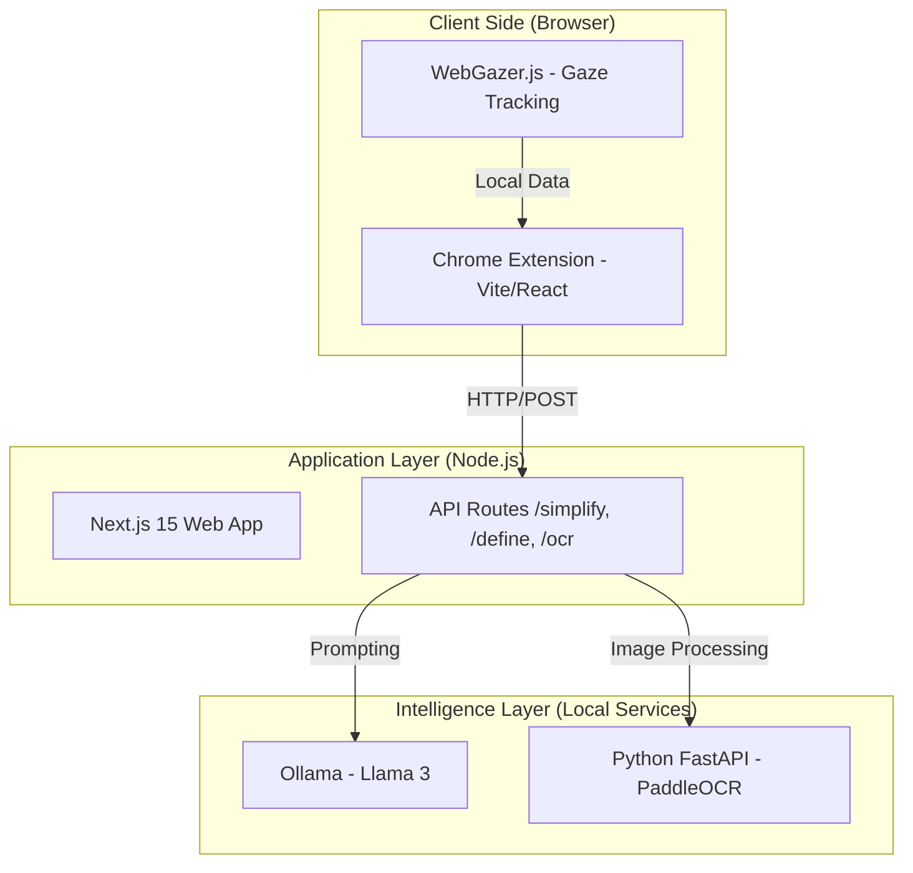

# 📖 Adaptive Cognitive Reading Companion (ACRC)

[](https://opensource.org/licenses/MIT)
[](#-privacy-and-ethics)
[](https://reactjs.org/)
[](https://nextjs.org/)

An intelligent, privacy-first reading assistant designed for individuals with dyslexia, ADHD, or cognitive reading challenges. ACRC leverages local Large Language Models (LLMs) and computer vision to provide real-time struggle detection, text simplification, and advanced reading aids—all within a secure, offline environment.

---

## 📸 Visual Demo

<div align="center">
  <table>
    <tr>
      <td align="center"><b>AI Assistance Popup</b><br/><br/><i>8-mode simplification, analogies & definitions</i></td>
      <td align="center"><b>Interactive Mind Map</b><br/><br/><i>Visualizing complex concepts dynamically</i></td>
    </tr>
  </table>
</div>

---

## 🚀 Vision
ACRC aims to make the web accessible for everyone by providing a suite of tools that adapt to the reader's needs. By processing everything locally, we ensure that the most personal data—what you read and how you read it—never leaves your device.

---

## ✨ Key Features

### 🛠️ Smart Reading Assistance (Chrome Extension)
- **AI Help Popup**: Trigger instant text transformation using local Llama 3:
  - **Simpler/Simplest**: Multi-level text simplification.
  - **Explain**: Detailed sentence breakdown with **Real-world Analogies**.
  - **Rephrase & Bullets**: Instant structural transformation for better scanning.
  - **Dictionary**: Context-aware definitions and synonyms.
- **Interactive Mind Maps**: Generate visual concept maps from selected text to aid structural understanding.
- **Struggle Detection**: Automatically detects reading difficulties based on hover time and re-reading patterns.
- **Interactive Typography**: Hover to highlight words with dynamic scaling and click-to-speech (TTS) integration.
- **Eye Tracking**: Experimental gaze-based struggle detection using `WebGazer.js` for hands-free assistance.

### 📏 Advanced Reading Aids
- **Reading Ruler**: Customizable guide line to maintain focus across lines.
- **Line Focus & Paragraph Isolation**: Dims or blurs non-essential content to minimize distractions.
- **Dyslexia-Friendly UI**: One-click font switching (OpenDyslexic, Lexie Readable) and high-contrast color themes.

### 📷 Industrial OCR & Intelligence
- **Document Scanning**: Extract text from images or physical documents via webcam using `PaddleOCR`.
- **Auto-Simplification Pipeline**: Extracted text is automatically passed through the simplification engine for immediate comprehension.
- **Reading Level Analysis**: Real-time Flesch-Kincaid readability scoring for any web content.

---

## 🏗️ Architecture & Technology Stack

The project is architected as a distributed local system to ensure performance and privacy.



### Tech Stack Breakdown
- **Frontend**: Vite, React 18, TypeScript, TailwindCSS v4.
- **Backend**: Next.js 15 (App Router), Python 3.10+, FastAPI.
- **Models**: Ollama (Llama 3), PaddleOCR (PP-OCRv4).
- **Computer Vision**: WebGazer.js (Eye tracking).

---

## 📁 Repository Structure

```text
.
├── extension/               # Chrome MV3 Extension (React/Vite)
├── web/                     # Central Hub & API Gateway (Next.js)
├── ocr-service/             # ML Microservice (Python/FastAPI)
├── Images/                  # Project screenshots and documentation assets
└── README.md                # Project Documentation
```

---

## 🛠️ Installation Guide

### Prerequisites
- **Node.js**: v18.0+
- **Python**: v3.8+ (Add to PATH)
- **Ollama**: [Download here](https://ollama.com)
- **Chrome/Edge**: Developer Mode enabled

### 1. Setup Local AI (Ollama)
```bash
ollama pull llama3
ollama serve
```

### 2. Setup OCR Service
```bash
cd ocr-service
python -m venv venv
source venv/bin/activate  # venv\Scripts\activate on Windows
pip install -r requirements.txt
python main.py
```

### 3. Setup Web Dashboard & API
```bash
cd web
npm install
npm run dev
```

### 4. Install Chrome Extension
1. Build the extension:
   ```bash
   cd extension
   npm install
   npm run build
   ```
2. Open `chrome://extensions/` in Chrome.
3. Enable **Developer Mode**.
4. Click **Load Unpacked** and select the `extension/dist` folder.

---

## 🔒 Privacy and Ethics
ACRC is built on the principle of **Zero-Knowledge Architecture**:
- **Local Inference**: AI processing occurs on your hardware. No text is sent to external APIs (OpenAI, Google, etc.).
- **Ephemeral Gaze Data**: Webcam data for eye tracking is processed frame-by-frame and never stored or transmitted.
- **Open Source**: Every line of code is auditable to ensure user trust.

---

## 📄 License
This project is licensed under the MIT License - see the [LICENSE](LICENSE) file for details.

---

## 🤝 Contributing
We welcome contributions! Please see our [Contributing Guidelines](CONTRIBUTING.md).

Built with ❤️ for accessible reading.
